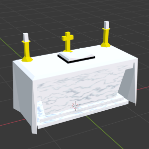
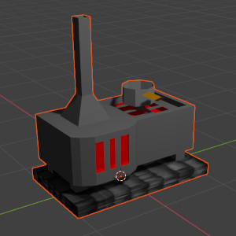
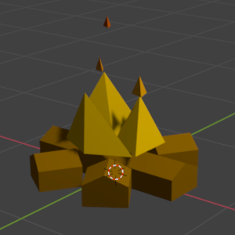
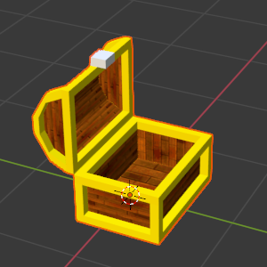
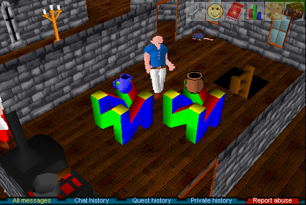
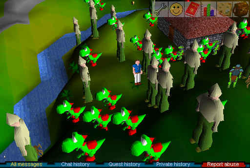

# rsc-models
(de)serialize runescape classic 3D model archives to and from
[wavefront .obj and .mtl](https://en.wikipedia.org/wiki/Wavefront_.obj_file)
files. supports automatic UV unwrapping. works with blender import and export.
use [rsc-sprites](https://github.com/2003scape/rsc-sprites) to dump and pack
textures.

[three.js model viewer](https://2003scape.github.io/rsc-models)

*models dumped and loaded into blender:*







*models exported from blender and loaded into the game:*




## install

    $ npm install @2003scape/rsc-models # -g for CLI program

## cli usage
```
rsc-models <command>

Commands:
  rsc-models dump-obj <config> <archive>    dump model OBJs from models jag
                                            archive
  rsc-models pack-obj <config> <archive>    pack model OBJ(s) into models jag
  <files..>                                 archive

Options:
  --help     Show help                                                 [boolean]
  --version  Show version number                                       [boolean]
```

    $ rsc-models dump-obj config85.jag models36.jag -o models36-obj/
    $ rsc-models pack-obj config85.jag models37.jag yoshi.obj n64.obj

## example
```javascript
const fs = require('fs');
const { Config } = require('@2003scape/rsc-config');
const { Models } = require('@2003scape/rsc-models');

const config = new Config();
config.loadArchive(fs.readFileSync('./config85.jag'));

const models = new Models(config);
models.loadArchive(fs.readFileSync('./models36.jag'));

// dumping wavefront
const tree = models.getModelByName('tree');

fs.writeFileSync('./tree.obj', tree.getObj());
fs.writeFileSync('./tree.mtl', tree.getMtl());

// loading external wavefront
const yoshi = models.fromWavefront(
    fs.readFileSync('./yoshi.obj', 'utf8'),
    fs.readFileSync('./yoshi.mtl', 'utf8')
);

models.setModel('tree', yoshi);

fs.writeFileSync('./models37.jag', models.toArchive());
```

## api
### models = new Models({ objects, textures }, extraNames = ANIMATED\_MODELS)
create a new models (de)serializer instance. extraNames are an array of model
names that aren't stored in the config archive's objects cache.

### models.loadArchive(buffer)
loads a models jag archive buffer.

### model.modelNames
array of valid model names.

### models.getModels()
return an array of all `Model` instances.

### models.getModelByName(name)
return a `Model` instance by name (defined in
[rsc-config](https://github.com/2003scape/rsc-config/blob/master/config-json/models.json)).

### models.getModelById(id)
return a `Model` instance based on index of model name.

### models.fromWavefront(objFile, mtlFile)
return a `Model` instance from wavefront .obj and .mtl file strings.

### models.toArchive()
return a models jag archive buffer.

### model = new Model({ textureNames }, { name, vertices, faces }?)
create a new model, either empty or using existing properies.

### model.name
name of ob3 file to use in archive (without extension).

### model.vertices
array of `{ x, y, z }` integers.

### model.faces
```javascript
[
    {
        // front face material
        fillFront: {
            i: 1, // illumination, 0 or 1
            r, g, b, // (0-248) each channel, or
            texture: textureIndex // from rsc-config
        } // or null,
        fillBack: null, // same format as fillFront, or null
        vertices: [] // array of vertex indexes (defined above)
    }
]
```

### model.updateFillIDs()
iterate through `model.faces` and update materials for .mtl file generation.

### model.getObj()
return model geometry string in wavefront .obj format.

### model.getMtl()
return model materials string in wavefront .mtl format.

### model.toJSON()
return public serializable properties.

### ANIMATED\_MODELS
array of hard-coded model names that aren't in config archive.

## model bugs

the following models have faces with less than three vertices:

 * logbridgelow
 * logbridgehigh
 * logbridgecurvedhigh
 * logbridgecurvedlow
 * treeplatformlow2
 * treeplatformhigh2
 * stonestand
 * grand tree-lev 0
 * tribalstature
 * grand tree-lev 1
 * grand tree-lev 2
 * fourwayplatform-lev 0
 * fourwayplatform-lev 1
 * grand tree-lev 3
 * blurberrybar
 * cave snaptrap
 * cave snaptrapa
 * rocksteps

there are also 25 secret models that are never loaded in the game (hashed):

 * 1037362809
 * -1060436729
 * -1115958269
 * -1220733691
 * 1227393374
 * -1263331649
 * 1347842162
 * -1430585029
 * 1512310831
 * 1526156672
 * 1540002513
 * 1657318544
 * 1721021053
 * 2142891767
 * -380606436
 * 515450526
 * 529296367
 * 538300861
 * 550294861
 * 564140702
 * 587507422
 * -669716258
 * -741690938
 * 763644315
 * 846098451

## license
Copyright 2022  2003Scape Team

This program is free software: you can redistribute it and/or modify it under
the terms of the GNU Affero General Public License as published by the
Free Software Foundation, either version 3 of the License, or (at your option)
any later version.

This program is distributed in the hope that it will be useful, but WITHOUT ANY
WARRANTY; without even the implied warranty of MERCHANTABILITY or FITNESS FOR A
PARTICULAR PURPOSE. See the GNU Affero General Public License for more details.

You should have received a copy of the GNU Affero General Public License along
with this program. If not, see http://www.gnu.org/licenses/.
